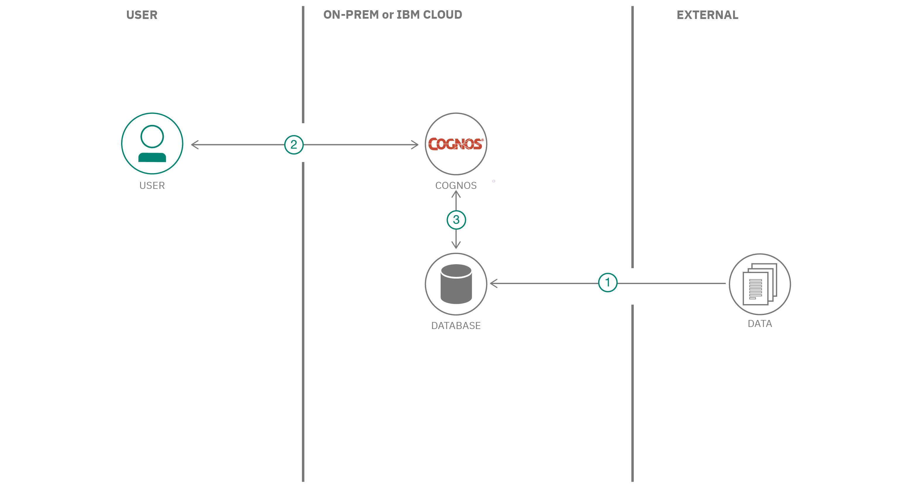

!!!! WORK IN PROGRESS !!!

# Leverage the voice of the customer using Watson Discovery to show business results in Cognos Analytics

To leverage the voice of the customer to drive business results, companies need to leverage AI to gain actionable insights from sentiment, emotion, concepts and key words mentioned in customer feedback. Much of the important data a customer wants to share can already be found. It exists in public forums, blogs, social media posts, chat logs with customer representatives. The challenges to leveraging this information has historically been the unstructured nature of it. Today though, we have AI and services like Watson Discovery that can be trained to aggregate, enrich and help surface key customer insights. This code pattern shows how you can visualize unstructured data from Watson Discovery and business data in Cognos Analytics for product performance analysis.

In this code pattern, unstructured data consisting of product reviews and customer surveys is imported into Cognos Analytics from Watson Discovery. The customer data also indicates the sentiment toward the products surveyed. This data can then be displayed on the Cognos Analytics dashboard. Sales revenue and product inventory data is also visually shown. Combining Cognos Analytics with Discovery, clients will:

* Get early warning of trends based on customer feedback.
* Address escalating customer interactions with early intervention.
* Target the right customers with the right products and the right marketing.
* Know where to invest in your business to drive revenue and customer adoption.
* Catch product inventory issues early.
* Get to the root cause of churning customers.
* Identify actions to increase your NPS or other customer satisfaction metric.

Here is an example of the types of visualzations we will be creating in this code pattern:

## Architecture flow

1. Product Review data is loaded into Watson Discovery for enrichment. Results include sentiment analysis and keyword discovery.
2. (Optional) Product and business data is loaded into Db2 Warehouse tables.
3. User runs Cognos Analytics.
4. Cognos Analytics can be linked to the Db2 Warehouse instance, **OR**
5. Data files are loaded directly into Cognos Analytics.

## Included components

* [Cognos Analytics](https://www.ibm.com/products/cognos-analytics): A business intelligence solution that empowers users with AI-infused self-service capabilities that accelerate data preparation, analysis, and repot creation.
* [Watson Discovery](https://www.ibm.com/watson/services/discovery/): A cognitive search and content analytics engine for applications to identify patterns, trends, and actionable insights.
* [IBM Db2 Warehouse](https://www.ibm.com/products/db2-warehouse): A client-managed, highly flexible operational data warehouse for private clouds and containerized deployments.

## Featured technologies

* [Node.js](https://nodejs.org/): An open-source JavaScript run-time environment for executing server-side JavaScript code.

## Instructions

> **Important**: Before proceeding, ensure that you have access to the latest release of Cognos Analytics. Click [here](https://www.ibm.com/account/reg/ca-en/signup?formid=urx-34710) to register for a free trial version.

The theme of this code pattern is built around data for a small coffee manufacturer that sells their products in local markets. The data will consist of reviews and ratings for their different coffee flavors, as well as associated sales and inventory data.

We will cover how to incorporate data from multiple sources, as well as how to create the visualizations in Cognos Analytics to best represent the data.

To better organize the content, this code pattern is divided into the following sections:

### Section 1. Visualize unstructured data from Watson Discovery in the Cognos Analytics Dashboard

In this section, we walk through the steps to:

* Gather product review data
* Upload data into Watson Discovery for enrichment and analysis
* Query Watson Discovery to capture keywords and sentiment
* Upload data into Cognos Analytics to create data modules and dashboard visualizations

<a href="https://github.com/IBM/cognos-analytics-using-unstructured-data/blob/master/doc/source/discovery-data.md">

### Section 2. Visualize customer insights with business data for product performance analysis

In this section, we build on the first section by adding:

* Sales, store and inventory data to support our coffee company product data
* Upload all product and business data into Db2 Warehouse tables
* Connect the Db2 Warehouse to Cognos Analytics
* Create additional Cognos Analytics dashboards to visualize business data

<a href="https://github.com/IBM/cognos-analytics-using-unstructured-data/blob/master/doc/source/business-data.md">

### Section 3. Visualize Sales based on Product Reviews Sentiments

In this section, we will analyze how product reviews sentiments impact sales of a product. To do that we will:

* Use product sales and review data
* Use a intermediary date table to create a relationship between sales and review based on their dates
* Create additional Cognos Analytics dashboards to visualize and analyze business data

<a href="https://github.com/IBM/cognos-analytics-using-unstructured-data/blob/master/doc/source/sales-by-sentiments.md">

# License

This code pattern is licensed under the Apache Software License, Version 2.  Separate third party code objects invoked within this code pattern are licensed by their respective providers pursuant to their own separate licenses. Contributions are subject to the [Developer Certificate of Origin, Version 1.1 (DCO)](https://developercertificate.org/) and the [Apache Software License, Version 2](https://www.apache.org/licenses/LICENSE-2.0.txt).

[Apache Software License (ASL) FAQ](https://www.apache.org/foundation/license-faq.html#WhatDoesItMEAN)
