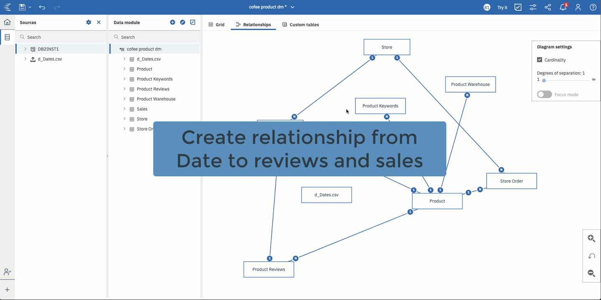
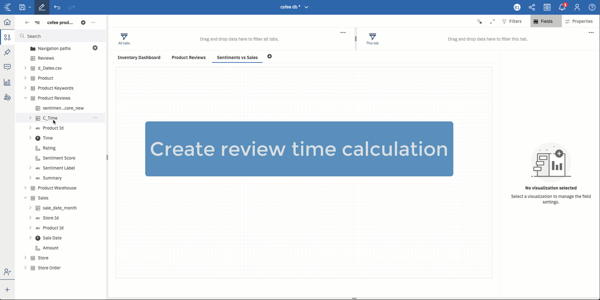
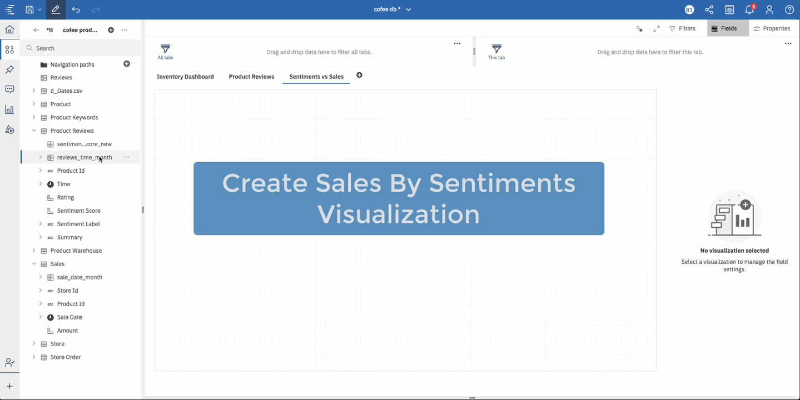
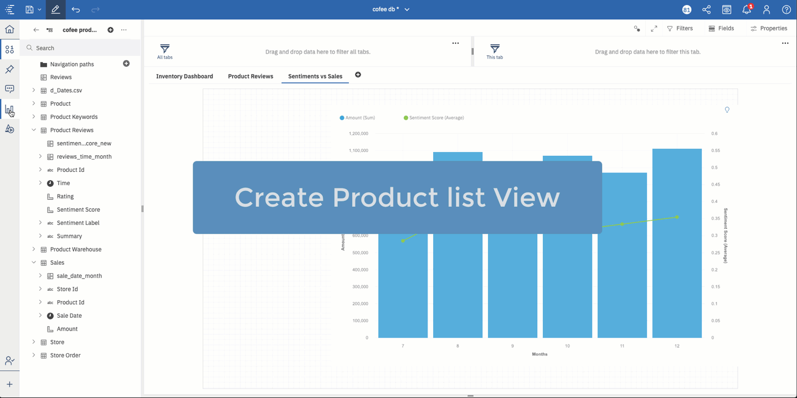

# Visualize the impact of sentimetns of  customer product reviews on sales

In this section, we will walk you through the process of creating a visualization where you can analyze the impact of product reviews sentiments on product sales. The sentiments provided are the scores generated by IBM Watson Discovery based on the customer reviews.

## Steps

1. [Create relationships between Product Reviews, Sales and Date](#1-create-relationships-between-product-reviews-sales-and-date)
1. [Create a review date time calculation](#2-create-a-review-date-time-calculation)
1. [Create a line and column visualization](#3-create-a-line-and-column-visualization)
1. [Create a list view to select products](#4-create-a-list-view-to-select-products)

## 1. Create relationships between Product Reviews, Sales and Date

In the data module view, go to the relatioship tab and create one to many relationship between the Data table to `Product Reviews` and `Sales` table.

>Note: The Data table is a date lookup table that contains each day, month and year of a date.

## 2. Create a review date time calculation

In the `Product Reviews` table create a calculation based on `time` column using a `_month` function which generates month based on the date provided.

## 3. Create a line and column visualization

From the `Product Reviews` table select the calculation you created in step 2, `Sentiment Score`, and from `Sales` table select select `Amount` and drag them to teh canvas. It will generate a `line and column` graph. The line represents the sentiment score and the bar represents the sales.

Make sure to rename the X and Y axis labels to appropriate names, and also provide a title to the graph as shown below.

## 4. Create a list view to select products

Lets create a list view with all the products so that the the `sales by sentiment` visualization gives you product specific results. By default the overall chart is the view of all product sales and their sentiments.

**Congratulations!** You now have created a visulization to analyze the impact of customer product reviews sentiments on the sales.

<table border="0">
  <tbody>
    <tr>
      <td align="left"> 
        &nbsp;&nbsp;&nbsp;&nbsp;&nbsp;&nbsp;&nbsp;&nbsp;
        &nbsp;&nbsp;&nbsp;&nbsp;&nbsp;&nbsp;&nbsp;&nbsp;
        &nbsp;&nbsp;&nbsp;&nbsp;&nbsp;&nbsp;&nbsp;&nbsp;
        &nbsp;&nbsp;&nbsp;&nbsp;&nbsp;&nbsp;&nbsp;&nbsp;
        &nbsp;&nbsp;&nbsp;&nbsp;&nbsp;&nbsp;&nbsp;&nbsp;
        &nbsp;&nbsp;&nbsp;&nbsp;&nbsp;&nbsp;&nbsp;&nbsp;
        &nbsp;&nbsp;&nbsp;&nbsp;&nbsp;&nbsp;&nbsp;&nbsp;
        &nbsp;&nbsp;
      </td>
     <td align="center">
        &nbsp;&nbsp;&nbsp;&nbsp;&nbsp;&nbsp;&nbsp;&nbsp;
        &nbsp;&nbsp;&nbsp;&nbsp;&nbsp;&nbsp;&nbsp;&nbsp;
        &nbsp;&nbsp;&nbsp;&nbsp;&nbsp;&nbsp;&nbsp;&nbsp;
        &nbsp;&nbsp;&nbsp;&nbsp;&nbsp;&nbsp;&nbsp;&nbsp;
        &nbsp;&nbsp;&nbsp;&nbsp;&nbsp;&nbsp;&nbsp;&nbsp;
        &nbsp;&nbsp;&nbsp;&nbsp;&nbsp;&nbsp;&nbsp;&nbsp;
        &nbsp;&nbsp;&nbsp;&nbsp;&nbsp;&nbsp;&nbsp;&nbsp;
        &nbsp;&nbsp;
      </td>
      <td align="right"> 
        &nbsp;&nbsp;&nbsp;&nbsp;&nbsp;&nbsp;&nbsp;&nbsp;
        &nbsp;&nbsp;&nbsp;&nbsp;&nbsp;&nbsp;&nbsp;&nbsp;
        &nbsp;&nbsp;&nbsp;&nbsp;&nbsp;&nbsp;&nbsp;&nbsp;
        &nbsp;&nbsp;&nbsp;&nbsp;&nbsp;&nbsp;&nbsp;&nbsp;
        &nbsp;&nbsp;&nbsp;&nbsp;&nbsp;&nbsp;&nbsp;&nbsp;
        &nbsp;&nbsp;&nbsp;&nbsp;&nbsp;&nbsp;&nbsp;&nbsp;
        &nbsp;&nbsp;&nbsp;&nbsp;&nbsp;&nbsp;&nbsp;&nbsp;
        &nbsp;&nbsp;
      </td>
    </tr>
  </tbody>
</table>
